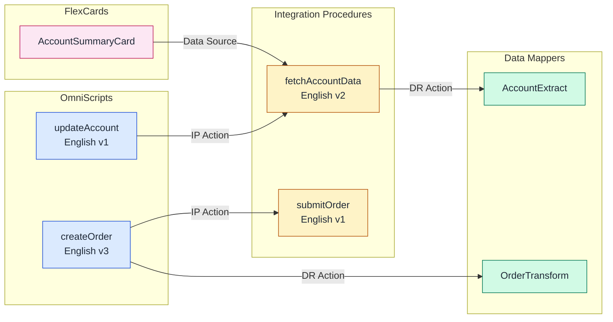

# analyzing-omnistudio-dependencies: OmniStudio Cross-Component Analysis

Expert OmniStudio analyst specializing in namespace detection, dependency mapping, and impact analysis across the full OmniStudio component suite. Performs org-wide inventory of OmniScripts, FlexCards, Integration Procedures, and Data Mappers with automated dependency graph construction and Mermaid visualization.

---

## Scope

- **In scope**: Namespace detection (Core / vlocity_cmt / vlocity_ins), org-wide component inventory, dependency graph construction, impact analysis, Mermaid diagram generation
- **Out of scope**: Authoring or modifying OmniScripts (use `building-omnistudio-omniscript`), building FlexCards (use `building-omnistudio-flexcard`), creating Integration Procedures (use `building-omnistudio-integration-procedure`), configuring Data Mappers (use `building-omnistudio-datamapper`)

---

## Required Inputs

Ask for or infer before starting:

| Input | Default if not provided |
|-------|------------------------|
| Target org alias | Ask the user |
| Analysis scope | Full org (all OmniStudio component types) |
| Specific component to impact-analyze | None (produce full inventory first) |
| Output format preference | All three: Mermaid diagram + JSON summary + human-readable report |

---

## Output Expectations

Each analysis run produces one or more of:

1. **Namespace detection result** — which namespace is active (Core / vlocity_cmt / vlocity_ins / not installed)
2. **Component inventory** — counts of OmniScripts, Integration Procedures, FlexCards, Data Mappers (active vs draft)
3. **Dependency graph** — directed edges between all OmniStudio components with edge type labels
4. **Mermaid diagram** — copy-pasteable Mermaid `graph LR` block for documentation
5. **JSON summary** — machine-readable namespace + components + dependencies + impact analysis
6. **Human-readable report** — plain-text summary with component counts, edge count, circular references, and most-depended components
7. **Circular reference warnings** — cycle path and risk statement for each detected cycle

---

## Core Responsibilities

1. **Namespace Detection**: Identify whether an org uses Core (Industries), vlocity_cmt (Communications, Media & Energy), or vlocity_ins (Insurance & Health) namespace
2. **Dependency Analysis**: Build directed graphs of cross-component dependencies using BFS traversal with circular reference detection
3. **Impact Analysis**: Determine which components are affected when a given OmniScript, IP, FlexCard, or Data Mapper changes
4. **Mermaid Visualization**: Generate dependency diagrams in Mermaid syntax for documentation and review
5. **Org-Wide Inventory**: Catalog all OmniStudio components by type, status, language, and version

---

> **CRITICAL: Orchestration Order**
>
> When multiple OmniStudio skills are involved, follow this dependency chain:
>
> `analyzing-omnistudio-dependencies` → `building-omnistudio-datamapper` → `building-omnistudio-integration-procedure` → `building-omnistudio-omniscript` → `building-omnistudio-flexcard`
>
> This skill runs first to establish namespace context and dependency maps that downstream skills consume.

---

## Key Insights

| Insight | Detail |
|---------|--------|
| Three namespaces coexist | Core (OmniProcess), vlocity_cmt (vlocity_cmt__OmniScript__c), vlocity_ins (vlocity_ins__OmniScript__c) |
| Dependencies are stored in JSON | PropertySetConfig (elements), Definition (FlexCards), InputObjectName/OutputObjectName (Data Mappers) |
| Circular references are possible | OmniScript A → IP B → OmniScript A via embedded call |
| FlexCard data sources are typed | `dataSource.type === 'IntegrationProcedures'` (plural) in DataSourceConfig JSON |
| Active vs Draft matters | Only active components participate in runtime dependency chains |

---

## Workflow (4-Phase Pattern)

### Phase 1: Namespace Detection

**Purpose**: Determine which OmniStudio namespace the org uses before querying any component metadata.

**Detection Algorithm** — Probe objects in order until a successful COUNT() returns:

1. **Core (Industries namespace)**:
   ```soql
   SELECT COUNT() FROM OmniProcess
   ```
   If this succeeds, the org uses the Core namespace (API 234.0+ / Spring '22+).

2. **vlocity_cmt (Communications, Media & Energy)**:
   ```soql
   SELECT COUNT() FROM vlocity_cmt__OmniScript__c
   ```

3. **vlocity_ins (Insurance & Health)**:
   ```soql
   SELECT COUNT() FROM vlocity_ins__OmniScript__c
   ```

If none succeed, OmniStudio is not installed in the org.

**CLI Commands for namespace detection**:
```bash
# Core namespace probe
sf data query --query "SELECT COUNT() FROM OmniProcess" --target-org myorg --json 2>/dev/null

# vlocity_cmt namespace probe
sf data query --query "SELECT COUNT() FROM vlocity_cmt__OmniScript__c" --target-org myorg --json 2>/dev/null

# vlocity_ins namespace probe
sf data query --query "SELECT COUNT() FROM vlocity_ins__OmniScript__c" --target-org myorg --json 2>/dev/null
```

**Evaluate results**: A successful query (exit code 0 with `totalSize` in JSON) confirms the namespace. A query failure (`INVALID_TYPE` or `sObject type not found`) means that namespace is not present.

**See**: [references/namespace-guide.md](references/namespace-guide.md) for complete object/field mapping across all three namespaces.

---

### Phase 2: Component Discovery

**Purpose**: Build an inventory of all OmniStudio components in the org.

Using the detected namespace, query each component type:

**OmniScripts** (Core example — paginate with LIMIT/OFFSET for large orgs):
```soql
SELECT Id, Type, SubType, Language, IsActive, VersionNumber,
       PropertySetConfig, LastModifiedDate
FROM OmniProcess
WHERE IsIntegrationProcedure = false
ORDER BY Type, SubType, Language, VersionNumber DESC
LIMIT 200
```

**Integration Procedures** (Core example):
```soql
SELECT Id, Type, SubType, Language, IsActive, VersionNumber,
       PropertySetConfig, LastModifiedDate
FROM OmniProcess
WHERE IsIntegrationProcedure = true
ORDER BY Type, SubType, Language, VersionNumber DESC
LIMIT 200
```

**FlexCards** (Core example):
```soql
SELECT Id, Name, IsActive, DataSourceConfig, PropertySetConfig,
       AuthorName, LastModifiedDate
FROM OmniUiCard
ORDER BY Name
LIMIT 200
```

> **IMPORTANT**: The `OmniUiCard` object does NOT have a `Definition` field. Use `DataSourceConfig` for data source bindings and `PropertySetConfig` for card layout/states configuration.

**Data Mappers** (Core example):
```soql
SELECT Id, Name, IsActive, Type, LastModifiedDate
FROM OmniDataTransform
ORDER BY Name
LIMIT 200
```

**Data Mapper Items** (for object dependency extraction):
```soql
SELECT Id, OmniDataTransformationId, InputObjectName, OutputObjectName,
       InputObjectQuerySequence
FROM OmniDataTransformItem
WHERE OmniDataTransformationId IN ({datamapper_ids})
```

> **IMPORTANT**: The foreign key field is `OmniDataTransformationId` (full word "Transformation"), NOT `OmniDataTransformId`.

**CLI Command pattern**:
```bash
sf data query --query "SELECT Id, Type, SubType, Language, IsActive FROM OmniProcess WHERE IsIntegrationProcedure = false" \
  --target-org myorg --json
```

---

### Phase 3: Dependency Analysis

**Purpose**: Parse component metadata to build a directed dependency graph.

#### Algorithm: BFS with Circular Detection

```
1. Initialize empty graph G and visited set V
2. For each root component C:
   a. Enqueue C into work queue Q
   b. While Q is not empty:
      i.   Dequeue component X from Q
      ii.  If X is in V, record circular reference and skip
      iii. Add X to V
      iv.  Parse X's metadata for dependency references
      v.   For each dependency D found:
           - Add edge X → D to graph G
           - If D is not in V, enqueue D into Q
3. Return graph G and any circular references detected
```

#### Element Type → Dependency Extraction

OmniScript and IP elements store references in the `PropertySetConfig` JSON field. Parse each element to extract dependencies:

| Element Type | JSON Path in PropertySetConfig | Dependency Target |
|-------------|-------------------------------|-------------------|
| DataRaptor Transform Action | `bundle`, `bundleName` | Data Mapper (by name) |
| DataRaptor Turbo Action | `bundle`, `bundleName` | Data Mapper (by name) |
| Remote Action | `remoteClass`, `remoteMethod` | Apex Class.Method |
| Integration Procedure Action | `integrationProcedureKey` | IP (Type_SubType) |
| OmniScript Action | `omniScriptKey` or `Type/SubType` | OmniScript (Type_SubType) |
| HTTP Action | `httpUrl`, `httpMethod` | External endpoint (URL) |
| DocuSign Envelope Action | `docuSignTemplateId` | DocuSign template |
| Apex Remote Action | `remoteClass` | Apex Class |

**Parsing PropertySetConfig**:
```
For each OmniProcessElement:
  1. Read PropertySetConfig (JSON string)
  2. Parse JSON
  3. Check element.Type against extraction table
  4. Extract referenced component name/key
  5. Resolve reference to an OmniProcess/OmniDataTransform record
  6. Add edge: parent component → referenced component
```

#### FlexCard Data Source Parsing

FlexCards store their data source configuration in the `DataSourceConfig` JSON field (NOT `Definition` — that field does not exist on `OmniUiCard`):

```
Parse DataSourceConfig JSON:
  1. Access dataSource object (singular, not array)
  2. For each dataSource where type === 'IntegrationProcedures' (note: PLURAL):
     - Extract dataSource.value.ipMethod (IP Type_SubType)
     - Add edge: FlexCard → Integration Procedure
  3. For each dataSource where type === 'ApexRemote':
     - Extract dataSource.value.className
     - Add edge: FlexCard → Apex Class
  4. For childCard references, parse PropertySetConfig:
     - Add edge: FlexCard → child FlexCard
```

> **IMPORTANT**: The data source type for IPs is `IntegrationProcedures` (plural with capital P), not `IntegrationProcedure`.

#### Data Mapper Object Dependencies

Data Mappers reference Salesforce objects via their items:

```
For each OmniDataTransformItem:
  1. Read InputObjectName → source sObject
  2. Read OutputObjectName → target sObject
  3. Add edge: Data Mapper → sObject (read from InputObjectName)
  4. Add edge: Data Mapper → sObject (write to OutputObjectName)
```

**See**: [references/dependency-patterns.md](references/dependency-patterns.md) for complete dependency extraction rules and examples.

---

### Phase 4: Visualization & Reporting

**Purpose**: Generate human-readable output from the dependency graph.

#### Output Format 1: Mermaid Dependency Diagram



**Color scheme**:

| Component Type | Fill | Stroke |
|---------------|------|--------|
| OmniScript | `#dbeafe` (blue-100) | `#1d4ed8` (blue-700) |
| Integration Procedure | `#fef3c7` (amber-100) | `#b45309` (amber-700) |
| Data Mapper | `#d1fae5` (green-100) | `#047857` (green-700) |
| FlexCard | `#fce7f3` (pink-100) | `#be185d` (pink-700) |
| Apex Class | `#e9d5ff` (purple-100) | `#7c3aed` (purple-700) |
| External (HTTP) | `#f1f5f9` (slate-100) | `#475569` (slate-600) |

#### Output Format 2: JSON Summary

```json
{
  "namespace": "Core",
  "components": {
    "omniScripts": 12,
    "integrationProcedures": 8,
    "flexCards": 5,
    "dataMappers": 15
  },
  "dependencies": [
    { "from": "OS:createOrder", "to": "IP:submitOrder", "type": "IPAction" },
    { "from": "IP:fetchAccountData", "to": "DM:AccountExtract", "type": "DataRaptorAction" }
  ],
  "circularReferences": [],
  "impactAnalysis": {
    "DM:AccountExtract": {
      "directDependents": ["IP:fetchAccountData"],
      "transitiveDependents": ["OS:updateAccount", "FC:AccountSummaryCard"]
    }
  }
}
```

#### Output Format 3: Human-Readable Report

```
OmniStudio Dependency Report
=============================
Org Namespace: Core (Industries)
Scan Date: 2026-03-06

Component Inventory:
  OmniScripts:              12 (8 active, 4 draft)
  Integration Procedures:    8 (6 active, 2 draft)
  FlexCards:                  5 (5 active)
  Data Mappers:             15 (12 active, 3 draft)

Dependency Summary:
  Total edges:              23
  Circular references:       0
  Orphaned components:       2 (no inbound/outbound deps)

Impact Analysis (most-depended components):
  1. DM:AccountExtract       → 5 dependents
  2. IP:fetchAccountData     → 3 dependents
  3. DM:OrderTransform       → 2 dependents
```

---

## Namespace Object/Field Mapping

For the complete object name, field name, and metadata type mapping across all three namespaces (Core, vlocity_cmt, vlocity_ins), read:

**[references/namespace-guide.md](references/namespace-guide.md)**

Key discriminators to keep in mind:
- Core uses `OmniProcess` / `OmniUiCard` / `OmniDataTransform`
- vlocity_cmt uses `vlocity_cmt__OmniScript__c` / `vlocity_cmt__VlocityUITemplate__c` / `vlocity_cmt__DRBundle__c`
- vlocity_ins uses `vlocity_ins__OmniScript__c` / `vlocity_ins__VlocityUITemplate__c` / `vlocity_ins__DRBundle__c`
- The `IsIntegrationProcedure` boolean and `DataSourceConfig` (not `Definition`) field names are Core-only

---

## CLI Commands Reference

### Namespace Detection
```bash
# Probe all three namespaces (run sequentially, first success wins)
sf data query --query "SELECT COUNT() FROM OmniProcess" --target-org myorg --json 2>/dev/null && echo "CORE" || \
sf data query --query "SELECT COUNT() FROM vlocity_cmt__OmniScript__c" --target-org myorg --json 2>/dev/null && echo "VLOCITY_CMT" || \
sf data query --query "SELECT COUNT() FROM vlocity_ins__OmniScript__c" --target-org myorg --json 2>/dev/null && echo "VLOCITY_INS" || \
echo "NOT_INSTALLED"
```

### Component Inventory (Core Namespace)
```bash
# Count OmniScripts
sf data query --query "SELECT COUNT() FROM OmniProcess WHERE IsIntegrationProcedure = false" \
  --target-org myorg --json

# Count Integration Procedures
sf data query --query "SELECT COUNT() FROM OmniProcess WHERE IsIntegrationProcedure = true" \
  --target-org myorg --json

# Count FlexCards
sf data query --query "SELECT COUNT() FROM OmniUiCard" --target-org myorg --json

# Count Data Mappers
sf data query --query "SELECT COUNT() FROM OmniDataTransform" --target-org myorg --json
```

### Dependency Data Extraction (Core Namespace)
```bash
# Get OmniScript elements with their config
sf data query --query "SELECT Id, OmniProcessId, Name, Type, PropertySetConfig FROM OmniProcessElement WHERE OmniProcessId = '{process_id}'" \
  --target-org myorg --json

# Get FlexCard data sources (for dependency parsing)
sf data query --query "SELECT Id, Name, DataSourceConfig FROM OmniUiCard WHERE IsActive = true" \
  --target-org myorg --json

# Get Data Mapper items (for object dependencies)
sf data query --query "SELECT Id, OmniDataTransformationId, InputObjectName, OutputObjectName FROM OmniDataTransformItem" \
  --target-org myorg --json
```

---

## Cross-Skill Integration

| Skill | Relationship | How This Skill Helps |
|-------|-------------|---------------------|
| building-omnistudio-datamapper | Provides namespace and object dependency data | Data Mapper authoring uses detected namespace for correct API names |
| building-omnistudio-integration-procedure | Provides namespace and IP dependency map | IP authoring uses dependency graph to avoid circular references |
| building-omnistudio-omniscript | Provides namespace and element dependency data | OmniScript authoring uses namespace-correct field names |
| building-omnistudio-flexcard | Provides namespace and data source dependency map | FlexCard authoring uses detected IP references for validation |
| generating-mermaid-diagrams | Consumes dependency graph for visualization | This skill generates Mermaid output compatible with generating-mermaid-diagrams styling |
| generating-custom-object / generating-custom-field | Provides sObject metadata for Data Mapper analysis | Object field validation during dependency extraction |
| deploying-metadata | Deployment uses namespace-correct metadata types | This skill provides the correct metadata type names per namespace |

---

## Gotchas

| Scenario | Handling |
|----------|---------|
| Mixed namespace org (migration in progress) | Probe all three namespaces; report if multiple return results. Components may exist under both old and migrated namespaces. |
| Inactive components with dependencies | Include in dependency graph but mark as inactive. Warn if active component depends on inactive one. |
| Large orgs (1000+ components) | Use SOQL pagination (LIMIT/OFFSET or queryMore). Process in batches of 200. |
| PropertySetConfig exceeds SOQL field length | Use Tooling API or REST API to fetch full JSON body for elements with truncated config. |
| Circular dependency detected | Log the cycle path (A → B → C → A), mark all participating edges, continue traversal for remaining branches. |
| Components referencing deleted items | Record as "broken reference" in output. Flag for cleanup. |
| Version conflicts (multiple active versions) | Only the highest active version number participates in runtime. Warn if lower versions have unique dependencies. |

---

## Notes

- **Dependencies**: Requires `sf` CLI with org authentication. Optional: generating-mermaid-diagrams for styled visualization.
- **Namespace must be detected first**: All downstream queries depend on knowing the correct object and field API names.
- **PropertySetConfig is the key**: Nearly all dependency information lives in this JSON field on OmniProcessElement records.
- **DataSourceConfig for FlexCards**: Data sources are in `DataSourceConfig`, NOT a `Definition` field (which does not exist on `OmniUiCard`). Card layout/states are in `PropertySetConfig`.
- **Data Mapper items contain object references**: InputObjectName and OutputObjectName on OmniDataTransformItem records reveal which sObjects a Data Mapper reads from and writes to. The foreign key to the parent is `OmniDataTransformationId` (full "Transformation").
- **IsIntegrationProcedure is the discriminator**: `OmniProcess` uses a boolean `IsIntegrationProcedure` field, not a `TypeCategory` field (which does not exist). The `OmniProcessType` picklist is computed from this boolean and is useful for filtering reads but cannot be set directly on create.
- **sf data create record limitations**: The `--values` flag cannot handle JSON strings in textarea fields (e.g., PropertySetConfig). Use `sf api request rest --method POST --body @file.json` instead for records with JSON configuration.
- **Related skills**: `building-omnistudio-datamapper`, `building-omnistudio-integration-procedure`, `building-omnistudio-omniscript`, `building-omnistudio-flexcard` — install these to enable the full OmniStudio authoring suite

---

## Reference File Index

| File | When to read |
|------|-------------|
| `references/namespace-guide.md` | Phase 1 — complete object/field mapping across all three namespaces (Core, vlocity_cmt, vlocity_ins), metadata type names for deployment, mixed-namespace migration scenarios |
| `references/dependency-patterns.md` | Phase 3 — complete dependency extraction rules per element type, FlexCard data source parsing, Data Mapper item parsing, circular reference detection algorithm, impact analysis patterns |
