# Agent Subagent Map Diagrams Reference

## Table of Contents

- [Purpose and Context](#purpose-and-context)
- [Fundamental Structure Rules](#fundamental-structure-rules)
- [Node Types and Agent Script Elements](#node-types-and-agent-script-elements)
- [Subagent Map Patterns](#subagent-map-patterns)
- [Complete Example: Local_Info_Agent](#complete-example-local_info_agent)
- [Validation Checklist](#validation-checklist)
- [Anti-patterns](#anti-patterns)

---

## Purpose and Context

A Subagent Map diagram is a Mermaid flowchart that visualizes an agent's subagent graph structure. It shows the architecture of an agent before implementation, displaying:

- The start_agent agent_router entry point
- All subagents in the agent
- Subagent transitions and routing logic
- Action calls within subagents (with backing type: Apex, Prompt Template, Flow)
- Gating conditions (available_when expressions)
- Variable state changes
- Escalation and off-topic handling
- Conditional instructions based on variable values

Subagent Map diagrams are the primary visual deliverable in an Agent Spec (design document) and serve both specification and comprehension purposes.

---

## Fundamental Structure Rules

### Graph Orientation

- ALWAYS use `graph TD` (Top-Down orientation)
- Start with start_agent agent_router at the top
- Subagents flow downward from the router
- Never use other orientations

### Node Identification

- Use sequential capital letters (A, B, C, ...) for node IDs
- Start with `A` for start_agent
- Increment sequentially through subagents and decisions
- Use descriptive labels within brackets

### Flow Direction

- Primary flow moves top-to-bottom
- Use `-->` for standard transitions
- Label decision branches with `|Label|` syntax
- Separate paths for different subagents

---

## Node Types and Agent Script Elements

### Start Agent Subagent Router Node

Format: `[start_agent agent_router]`

Represents the entry point where user input is evaluated and routed to appropriate subagents.

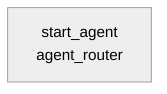

### Subagent Nodes

Format: `[subagent_name Subagent]`

Represents a subagent within the agent.

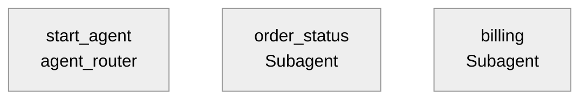

### Action Call Nodes

Format: `[Call action_name backing: Type]`

Backing types: Apex, Prompt Template, Flow

Example: `[Call check_weather backing: Apex]`

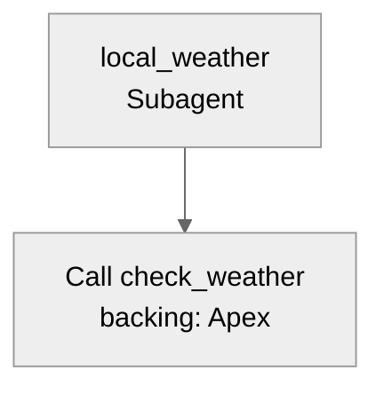

### Decision/Gating Nodes

Use curly braces `{}` for conditions. Common formats:

- Variable availability gates: `{Check: variable_name != empty?}`
- Conditional instructions: `{variable_name == value?}`
- Subagent transition logic: `{user_intent matches?}`

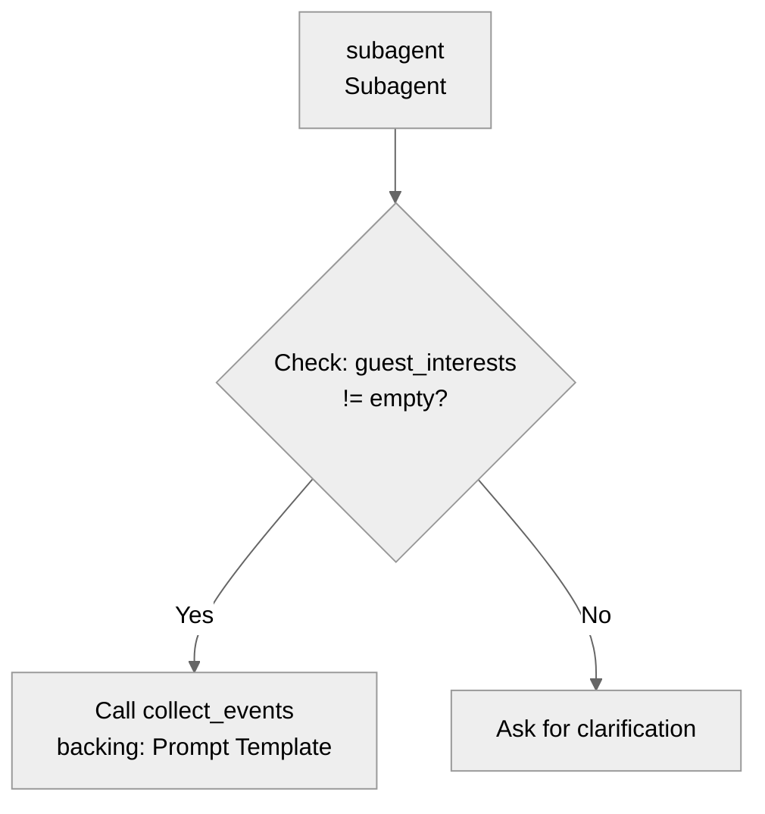

### Variable State Change Nodes

Format: `[Set variable_name = value]`

Shows state modifications that affect downstream behavior.

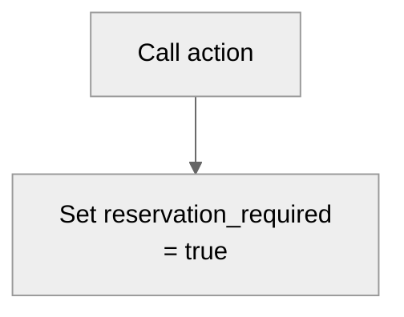

### Utility Call Nodes

Format: `[Call @utils.name]`

For escalation and system utilities.

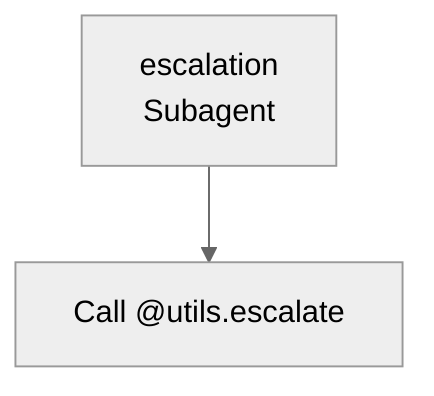

---

## Subagent Map Patterns

### Basic Subagent with Single Action

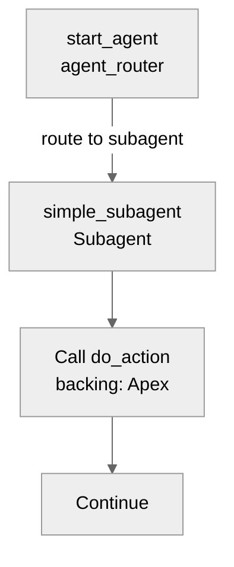

### Subagent with Gating Condition

Available_when expressions prevent action execution until conditions are met.

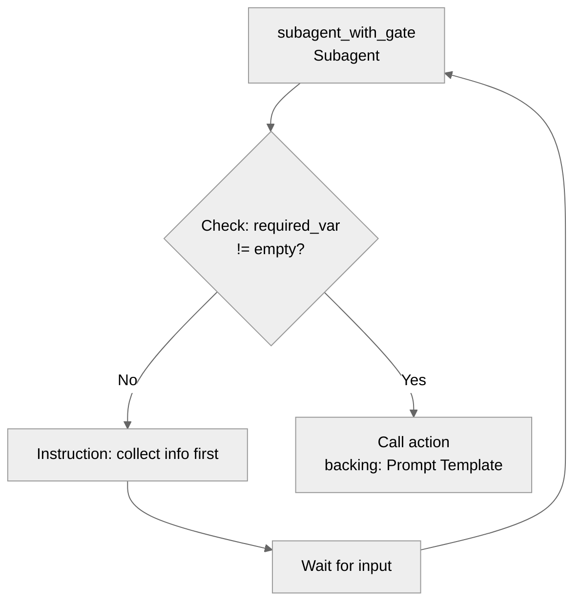

### Subagent with Conditional Instructions

Variable values control which instructions apply to a subagent.

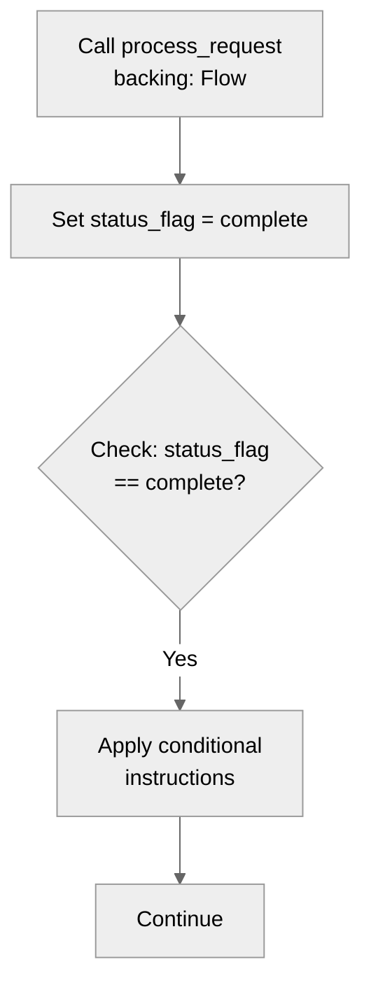

### Subagent Transitions

When logic determines a new subagent should be active.

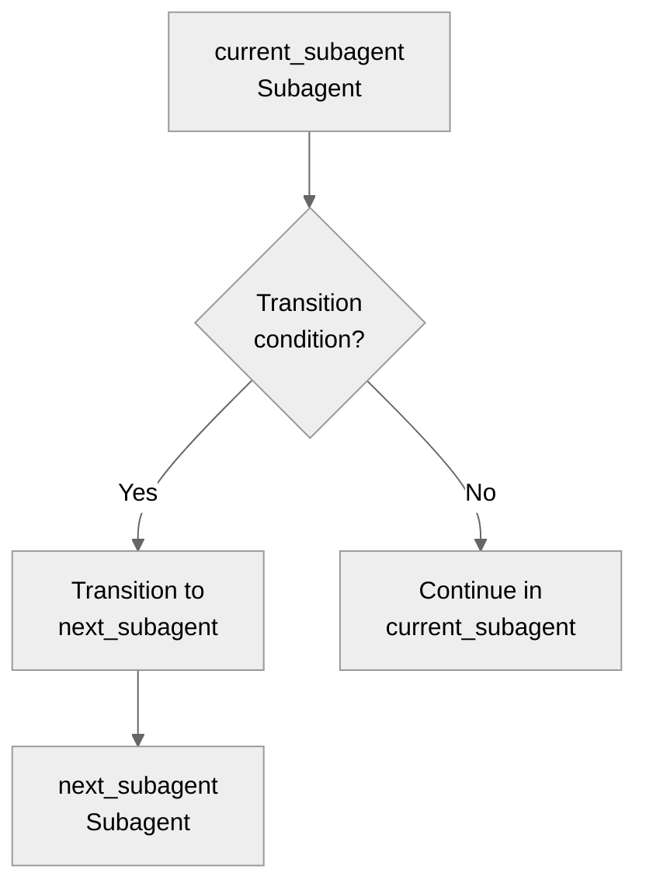

### Off-Topic and Escalation Routing

How the agent handles out-of-scope requests.

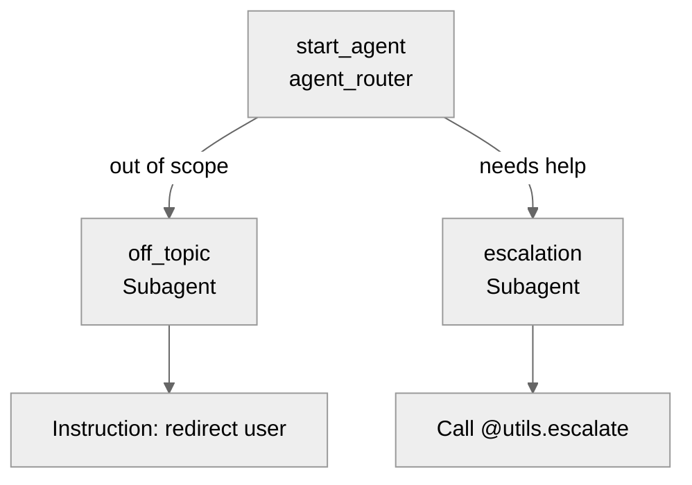

---

## Complete Example: Local_Info_Agent

This example demonstrates a complete Subagent Map for a guest information agent with multiple subagents, gating conditions, variable state, and escalation handling.

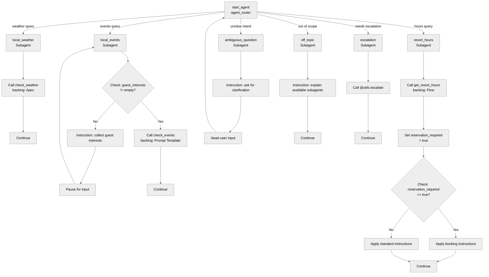

### Subagent Descriptions

**local_weather**: Provides weather information via Apex-backed action. No preconditions.

**local_events**: Requires guest_interests variable to be populated (gating: `available_when guest_interests != ""`). Calls Prompt Template-backed action only when gate is satisfied.

**resort_hours**: Calls Flow-backed action that sets reservation_required variable. Conditional instructions applied based on variable state: booking-specific guidance when true, standard guidance when false.

**ambiguous_question**: No actions. Requests clarification and routes back to start_agent.

**off_topic**: No actions. Explains available subagents and continues conversation.

**escalation**: Calls @utils.escalate utility to route to human agent.

**start_agent agent_router**: Routes incoming user input to appropriate subagents based on intent.

---

## Validation Checklist

Before finalizing a Subagent Map diagram:

- [ ] Uses `graph TD` syntax
- [ ] Starts with `%%{init: {'theme':'neutral'}}%%`
- [ ] start_agent agent_router is node A at top
- [ ] Nodes use sequential capital letter IDs
- [ ] All subagents labeled with `[subagent_name Subagent]` format
- [ ] Action calls include backing type (Apex, Prompt Template, Flow)
- [ ] Gating conditions shown as decision nodes with `{Check: ...?}` format
- [ ] Variable state changes explicitly labeled with `[Set variable = value]`
- [ ] Escalation uses `[Call @utils.escalate]` format
- [ ] All transition branches are labeled
- [ ] Diagram fits in 20-30 nodes
- [ ] Subagent routing from start_agent is clear
- [ ] Off-topic and escalation paths are visible
- [ ] Conditional instruction logic is shown

---

## Anti-patterns

### Don't

- Use `graph LR` or other orientations instead of `graph TD`
- Place start_agent anywhere except top (node A)
- Label actions without backing type information
- Use ambiguous decision node labels (avoid `{Process?}`)
- Hide gating conditions in node descriptions instead of showing as decisions
- Omit variable state changes that affect downstream behavior
- Create subagent routing without labels on the decision logic
- Mix subagent nodes with action nodes at same level without clear containment
- Use custom color styling (breaks in dark mode)
- Leave off-topic and escalation paths out of diagram

### Do

- Keep start_agent agent_router at the top
- Show all subagents reachable from start_agent
- Include backing type for every action call
- Make gating conditions explicit as decision nodes
- Show variable updates as separate nodes when they affect logic flow
- Label all transition branches
- Include off-topic and escalation subagents
- Show conditional instructions with decision nodes
- Use `%%{init: {'theme':'neutral'}}%%` for light/dark mode compatibility
- Focus diagram on subagent structure, not detailed action logic
